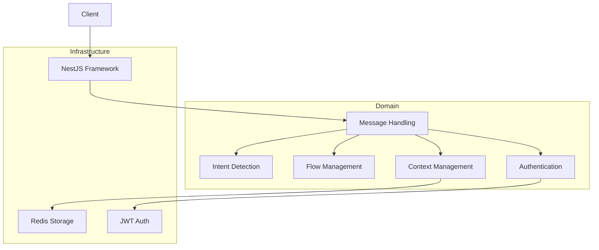

# Clare and Me - Design Document

## Architecture Overview

The Clare and Me service is built using a modular architecture based on the principles of Clean Architecture and Domain-Driven Design. The application follows the "Screaming Architecture" pattern, where the structure of the codebase clearly communicates its purpose and business domains.

### Key Architectural Principles

1. **Screaming Architecture**: The top-level directory structure and module names reflect the business domains and use cases, not the tools or frameworks used.

2. **Separation of Concerns**: The application is divided into distinct layers, each with a specific responsibility.

3. **Dependency Inversion**: High-level modules do not depend on low-level modules. Both depend on abstractions.

4. **Modularity**: The codebase is organized into loosely coupled modules that can be easily replaced or modified without affecting the entire system.

5. **Framework Independence**: The core business logic is decoupled from the web framework and other external tools, allowing for easy replacement of these components if needed.

### Key Components

1. **Intent Detection**: Classifies incoming messages as FAQ, Suicide Risk, or normal messages.
2. **Flow Management**: Manages conversation flows (Normal and Check-In).
3. **Context Management**: Maintains the state of conversations using Redis.
4. **Message Handling**: Processes incoming messages and coordinates responses.
5. **Authentication**: Secures API endpoints using JWT.

### Architecture Diagram

The following diagram illustrates the high-level architecture of the Clare and Me application:



This diagram shows the separation between the Domain and Infrastructure layers, as well as the relationships between the key components of the application.

## Implementation Details

### Screaming Architecture and Modularity

The project structure clearly reflects the business domains:

```
src/
├── domain/
│   ├── authentication/
│   ├── context-management/
│   ├── flow-management/
│   ├── intent-detection/
│   ├── message-handling/
│   └── shared/
└── infrastructure/
    ├── nestjs/
    ├── storage/
    └── validators/
```

Each domain directory contains the core business logic and interfaces, while the infrastructure directory contains the implementations of these interfaces and integration with external tools and frameworks.

### Dependency Inversion and Inversion of Control (IoC)

1. **Interface Segregation**: Each domain defines its own interfaces (e.g., `IStorageService` in context-management).

2. **Dependency Injection**: NestJS's built-in IoC container is used to inject dependencies, allowing for easy swapping of implementations.

3. **Abstraction of External Dependencies**: Redis, JWT, and other external tools are abstracted behind interfaces, allowing for easy replacement without affecting the core business logic.

### Framework Independence

1. The core business logic in the `domain` directory is framework-agnostic. It doesn't import or use any NestJS-specific code.

2. NestJS-specific code is isolated in the `infrastructure/nestjs` directory, which acts as an adapter between the framework and the domain logic.

3. This separation allows for potentially replacing NestJS with another framework (e.g., Express) with minimal changes to the core business logic.

### Intent Detection

The `IntentDetectionService` uses a simple keyword-based approach to classify messages. This can be easily extended or replaced with more sophisticated NLP models in the future.

### Flow Management

The `FlowManagementService` handles two types of flows:
- Normal Flow: For general interactions and support.
- Check-In Flow: Initiated by the system for mood check-ins.

The service maintains the current flow state for each user in Redis.

### Context Management

The `ContextManagementService` uses Redis to store and retrieve conversation context. This allows the application to maintain stateless servers while preserving conversation state.

### Message Handling

The `MessageHandlingService` coordinates between Intent Detection, Flow Management, and Context Management to process messages and generate appropriate responses.

### Authentication

JWT authentication is implemented using `@nestjs/passport` and `passport-jwt`. All endpoints except the health check are protected.

## Data Flow

1. An incoming message is received by the `MessageHandlingController`.
2. The message is passed to the `IntentDetectionService` for classification.
3. Based on the intent, the `MessageHandlingService` decides how to process the message:
   - FAQ: Provides a predefined response.
   - Suicide Risk: Provides a sensitive response and continues with the previous flow.
   - Normal: Passes to the `FlowManagementService` for further processing.
4. The `FlowManagementService` determines the current flow (Normal or Check-In) and generates an appropriate response.
5. The `ContextManagementService` is used throughout to maintain and update conversation context.

## Scalability and Performance

- The use of Redis for context storage allows for horizontal scaling of the application servers.
- The modular architecture allows for easy replacement or upgrade of individual components (e.g., replacing the intent detection with a more sophisticated ML model).
- Stateless design of the application servers enables easy deployment and scaling in containerized environments.

## Future Improvements

1. Integrate with an AI model like GPT for more dynamic and context-aware responses.
2. Implement more sophisticated intent detection using machine learning models.
3. Add more comprehensive error handling and logging.
4. Implement rate limiting to prevent abuse of the API.
5. Add support for multiple languages.
6. Implement a more robust system for managing and updating FAQ responses.
7. More thorough e2e and integration testing.

## Security Considerations

- All endpoints (except health check) are protected by JWT authentication.
- Sensitive data (e.g., Redis password, JWT secret) is managed through environment variables.
- Input validation is performed using Zod schemas to prevent injection attacks.
- The application runs as a non-root user in the Docker container for improved security.

This design allows for a flexible, scalable, and secure implementation of the Clare and Me service, with room for future enhancements and integrations. The use of Clean Architecture principles, Screaming Architecture, and extensive IoC strategies ensures that the codebase is maintainable, testable, and adaptable to changing requirements or technologies.
