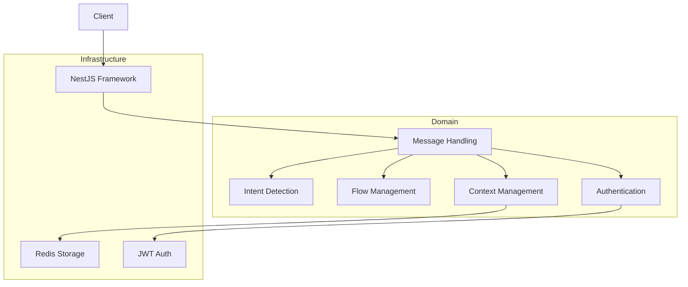

# Clare and Me - Intent Detection and Flow Management Service

This service classifies user messages, manages conversation flows, and maintains context for mental health support conversations.

## Prerequisites

- Node.js (v18 or later)
- npm
- Redis
- Docker (for containerization)
- Docker Compose (for running the application with dependencies)

## Architecture

Clare and Me is built using a modular architecture based on the principles of Clean Architecture and Domain-Driven Design. The application follows the "Screaming Architecture" pattern, where the structure of the codebase clearly communicates its purpose and business domains.

Key architectural features:

1. **Screaming Architecture**: The top-level directory structure and module names reflect the business domains and use cases, not the tools or frameworks used.
2. **Modularity**: The codebase is organized into loosely coupled modules that can be easily replaced or modified without affecting the entire system.
3. **Dependency Inversion**: High-level modules do not depend on low-level modules. Both depend on abstractions.
4. **Framework Independence**: The core business logic is decoupled from the web framework (NestJS) and other external tools, allowing for easy replacement of these components if needed.

The application is divided into several key components:

- Intent Detection
- Flow Management
- Context Management
- Message Handling
- Authentication

Here's a high-level diagram of the Clare and Me architecture:



For a more detailed explanation of the architecture, including the implementation details, data flow, and future improvements, please refer to the [DESIGN.md](DESIGN.md) file.

## Installation

1. Clone the repository:
   ```
   git clone https://github.com/your-repo/clare-and-me.git
   cd clare-and-me
   ```

2. Install dependencies:
   ```
   npm install
   ```

3. Set up environment variables:
   Create a `.env` file in the root directory and add the following variables:
   ```
   REDIS_HOST=localhost
   REDIS_PORT=6379
   REDIS_PASSWORD=your_redis_password
   JWT_SECRET=your_jwt_secret
   ```
   
Or copy `.env.example` to `.env`

## Running the Application

### Using Node.js and Redis locally

1. Start Redis:
   ```
   redis-server
   ```

2. Run the application:
   ```
   npm run start:dev
   ```

The application will be available at `http://localhost:3000`.

### Using Docker Compose

To run the application along with its Redis dependency using Docker Compose:

1. Make sure you have Docker and Docker Compose installed on your system.

2. From the root directory of the project, run:
   ```
   docker-compose up
   ```

   This command will build the application image (if not already built) and start both the application and Redis containers.

3. The application will be available at `http://localhost:3000`.

4. To stop the application and Redis, use:
   ```
   docker-compose down
   ```

Note: When using Docker Compose, the environment variables in the `docker-compose.yml` file will override those in your `.env` file for the application container. The Redis connection details are automatically configured for the containerized environment.

## API Endpoints

- POST /sendMessage: Classify messages and handle flows
- POST /flow-management/initiateCheckIn: Start a Check-In Flow and set context
- GET /retrieveContext/:userId: Get the current context for a user
- POST /updateContext: Update context in Redis
- GET /health: Health check endpoint (not authenticated)

The app also has Swagger UI running at `http://localhost:3000/api`

## Authentication

All endpoints except for the health check (/health) are protected by JWT authentication. Include the JWT token in the Authorization header of your requests:

```
Authorization: Bearer your_jwt_token
```

You can obtain this token calling `/register` endpoint and also subsequently calling the `/login` endpoint with your credentials. In the swagger UI, it's very convenient to use this API by putting your JWT in the "Authorize" button at the top.

## Testing

Run the test suite with:

```
npm run test
```

For end-to-end tests:

```
npm run test:e2e
```

## Assumptions

1. The service uses fixed responses for FAQ and suicide risk detection. Integration with an AI model like GPT can be implemented for more dynamic responses.
2. The Check-In Flow is initiated by the system and managed through the /initiateCheckIn endpoint.
3. Redis is used for storing conversation context and flow state.
4. JWT is used for authentication, but the token generation process is not included in this service.
5. The service is designed to be stateless and can be scaled horizontally.

## Deployment

### Using Docker

The application can be containerized using Docker. Build the Docker image with:

```
docker build -t clare-and-me .
```

Run the container with:

```
docker run -p 3000:3000 clare-and-me
```

Ensure that Redis is accessible to the container, either by linking a Redis container or providing the correct host and port in the environment variables.

### Using Docker Compose

For a more streamlined deployment that includes both the application and Redis, use Docker Compose as described in the "Running the Application" section above. This method is recommended for development and testing environments, as it automatically sets up the required services with the correct configurations.